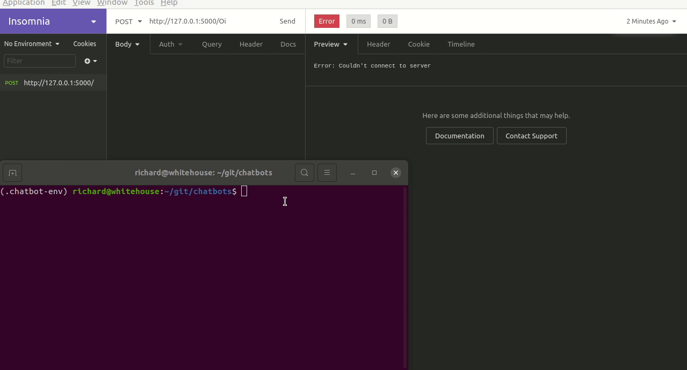
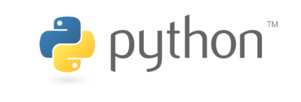
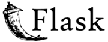
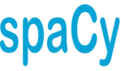

# Chatbots

## Repositório utilizado para aprendizado do desenvolvimento de chatbots

### Chatbot com Python e NLTK_01.ipynb

Trata-se do primeiro exemplo simples, utilizando a lib NLTK e a funçao de reflections, responsavel pelo tratamento de linguagem natural, onde é realizado o teste com a nltk.chat.eliza.demo().

### Chatbot com Python e NLTK para pesquisar documentos.

Segundo exemplo, realizando o scrapy de uma pagina da wikipedia, com o beautifulsoup, carregando e fazendo o pré-processamento aplicantado as técnicas.

- Lower transform
- Tokenizer
- Stop_words remove
- Punctuation remove
- Url remove
- Calculo do TF-IDF (Term frequency - inverse document frequency)
- Calculo de similaridade dos cosenos

### Chatbot  3 - API em Flask.

### Instalação

1. Clone o repositório digitando `$ git clone git@github.com:richardnixonafj/chatbots.git` no Gitbash.
2. Vá até a pasta onde você clonou o repositório em seu computador, o ideal é sempre criar um novo ambiente isolado `$ python3 -m venv .new-venv`
3. Digite `$  pip install -r requirements.txt` para instalar as bibliotecas do projeto.
4. Digite `$ python3 -m spacy download pt` para baixar o suporte da lib spacy ao idioma pt-br.
5. Execute o seguinte arquivo: `python3 app.py`
6. Use o seu cliente de Rest Favorito (Postman, insomnia..) 
7. Semelhante aos demais chatbots, neste caso é possivel passar parametros via `POST` para API construida em Flask.

## :rocket: Tecnologias

Neste projeto foram utilizadas as seguintes Tecnologias:

 
## Contato
Se você quiser entrar em contato comigo:

richardnixon@posteo.org

## Licença
Este projeto usa a seguinte licença: <GPT3>.
 

 

 

